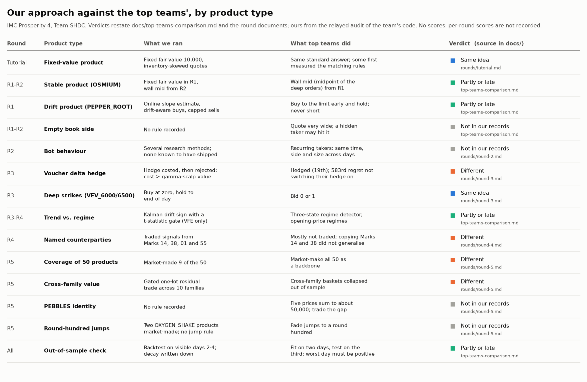
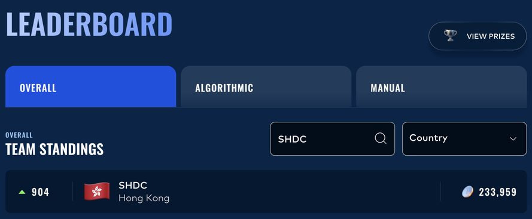
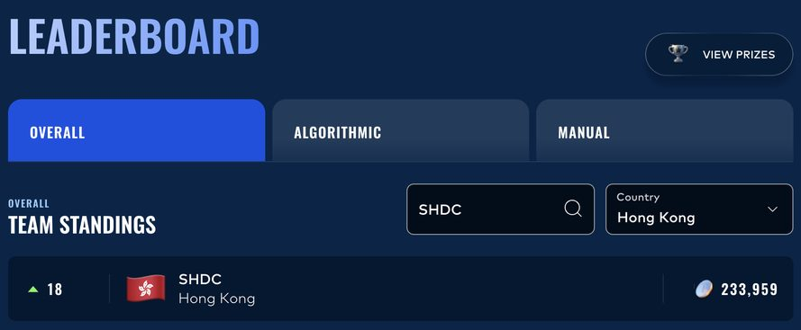

# IMC Prosperity 4: Team SHDC, a lessons-learned write-up

**904th of 18,803 teams (top 4.81%), 18th in Hong Kong; algorithmic 917th, manual 1,132nd** ([Results](#results)).

The field's best ideas set against ours, round by round. A team of three: teammates coded the early rounds; Oscar coded rounds 4 and 5 ([who did what](#who-did-what)). What the team built:

<!-- built:start -->
- **Tutorial:** fixed-fair-value (10,000) market making with inventory skew on EMERALDS; mean-reverting market making on TOMATOES.
- **Round 1:** fixed-fair-value takes plus passive quotes on OSMIUM; an online drift-slope estimate with drift-aware buys on PEPPER_ROOT.
- **Round 2:** wall-mid, inventory-neutral market making; a GP-UCB script that proposed the next parameter run.
- **Round 3:** market making on HYDROGEL, VELVETFRUIT and ten vouchers; buy-at-zero deep strikes; delta hedging costed and rejected.
- **Round 4 (Oscar):** fixed-anchor market making plus named-counterparty signals; a Kalman drift filter with an uncertainty gate.
- **Round 5 (Oscar):** Kalman/OU market making on 9 of 50 products; a gated one-lot cross-family residual trade.
<!-- built:end -->



Per-round table with lessons: [Approach](#approach). The demo verifies the write-up's links and structure and prints the summary (Python 3, no installs):

```bash
git clone <this repo> && cd imc-prosperity-4-shdc
bash scripts/demo.sh
```

Scores come from leaderboard screenshots ([assets/leaderboard/](assets/leaderboard/)) and strategies from a relayed AI audit of the team's unpublished code ([Limits](#limits)); the write-up was drafted with AI coding agents under Oscar's design and review.

## The problem

IMC Prosperity 4 is a team trading competition run by IMC Trading, with [18,803 teams](https://prosperity.imc.com/). After a tutorial come five rounds, each with an **algorithmic** track (a Python `Trader` run against market bots under position limits, with new products each round) and a **manual** track (a one-shot puzzle answered with numbers). Rounds 1 and 2 were a qualifier; the leaderboard reset for the finals, rounds 3 to 5 ([scoring](docs/top-teams-comparison.md#how-the-rounds-were-scored)).

## Approach

Each [round document](docs/rounds/round-1.md) follows one template. The lesson column is derived from the records, not Oscar's words (his are under [What I learned](#what-i-learned)). Detail: [top-teams-comparison.md](docs/top-teams-comparison.md), [manual-rounds.md](docs/manual-rounds.md).

| Round | Products | Where top teams differed | Mistake or lesson (derived) |
|---|---|---|---|
| [Tutorial](docs/rounds/tutorial.md) | EMERALDS, TOMATOES | One team first tested the matching rules | No record that we measured the matching rules first |
| [1](docs/rounds/round-1.md) | ASH_COATED_OSMIUM, INTARIAN_PEPPER_ROOT | Wall mid from the start; wide quotes into an empty book side; PEPPER_ROOT held at the limit | Notes warn the replay may overstate. Lesson: a replay is a filter, not a forecast |
| [2](docs/rounds/round-2.md) | Same two, plus a market-access bid | Recurring bot takers found by comparing raw trades day against day | Compare raw trades day against day before adding models |
| [3](docs/rounds/round-3.md) | HYDROGEL_PACK, VELVETFRUIT_EXTRACT, 10 call vouchers | Write-ups that discuss a voucher delta hedge favour it; some fitted a smile | Cost a hedge, and keep the inputs (ours were not kept) |
| [4](docs/rounds/round-4.md) | Same, plus named counterparties | Most shipped no counterparty signal; one team found Marks 14 and 38 did not generalise | We traded Marks 14 and 38. Lesson: validate on a held-out day first |
| [5](docs/rounds/round-5.md) | 50 products in 10 families | Market making on all 50; exact identities; round-hundred reversion; cross-family baskets dropped out of sample | Replay PnL decayed; submitted file unidentified. Lesson: record what was submitted |

### Who did what

By Oscar's account (the team folder has no git history): three members. The two teammates, anonymous here, coded the tutorial and rounds 1 to 3. Oscar coded rounds 4 and 5: the Kalman drift gate that replaced the 5,000-tick gate and the counterparty signals in round 4; the Kalman/OU/inventory market making on nine primary products and the family cross-gate in round 5. He also checked the team's results: "I even verified all their results".

## Results

**Official (final leaderboard).** Source: leaderboard screenshots taken 2026-06-01 (the public leaderboard has since been taken down), in [assets/leaderboard/](assets/leaderboard/).




<!-- results:start -->
| Track | Score | Global rank | Top % of 18,803 | Hong Kong rank |
|---|---:|---:|---:|---:|
| Overall | 233,959 | 904 | 4.81% | 18 |
| Algorithmic | 86,750 | 917 | 4.88% | 20 |
| Manual | 147,209 | 1,132 | 6.02% | 26 |
<!-- results:end -->

"Top %" is rank ÷ 18,803, and 86,750 + 147,209 = 233,959. Manual earned more points, but algorithmic ranked better; points compare only within a track.

**Which rounds this covers.** Three linked write-ups state that the leaderboard reset after round 2 and that the final ranking counts the finals only ([Team Infinite 88](https://github.com/Chamoy-code/imc-prosperity-4-challenge): "Phase 2 performance only (Rounds 3–5)"; [DTU Quant Lab](https://github.com/DataAthleteChamp/dtu-quant-lab-imc-prosperity-4); [Une Baguette Fromage](https://github.com/Durpie-Git/imc-prosperity-4)). So 233,959 and 86,750 very likely cover rounds 3 to 5, and Oscar's rounds 4 and 5 are two of the three scored algorithmic rounds. Our own records do not settle it; per-round scores were not recorded.

**LOCAL BACKTEST, NOT OFFICIAL** (audit of the team's code, relayed): the round-1 trader replayed at ≈63,464 (3-day mean), with the team's note that the replay may overstate; the round-5 cross-gate portfolio replay (local) gave 127,494 with passive and 165,281 with take-only execution on visible days 2–4, with PnL decaying across the days and the hidden-test risk written down.

**Replay against result.** That one-round local replay exceeds the official algorithmic 86,750 for the scored rounds. They are not directly comparable (units unrecorded; local matching on visible days against official hidden days), so this is not a measured overstatement, only the plainest sign that a replay's level is a filter, not a forecast.

## How to run

```bash
bash scripts/demo.sh     # link and round-template checks, then the result table and per-round summary
bash scripts/check.sh    # unit tests of the checker, then the demo (what CI runs)
```

Python 3 only, seconds each; `python scripts/make_figure.py` redraws the figure (needs matplotlib).

## Architecture

The team's tools, per the audit: GeyzsoN's Rust backtester for local replays, gsgill7's fork of jmerle's visualiser ([credits](docs/credits.md)), and a team-built "interface for data analysis and visualisation" (Oscar's words; source not recovered).

```text
docs/rounds/                    tutorial and rounds 1-5, one template each
docs/top-teams-comparison.md    what top teams did that we did not, by theme
docs/lessons.md                 lessons derived from the records, and other teams' lessons
docs/design-decisions.md        four recorded decisions and their trade-offs
docs/manual-rounds.md           the five manual challenges
docs/after-the-competition.md   post-competition SYNTHETIC analysis tools
docs/pair-trading-notes.md      post-competition study notes on pair trading
scripts/docs.py, demo.sh        link and template checks; the demo
scripts/check.sh                tests plus demo, run by .github/workflows/ci.yml
scripts/make_figure.py          draws assets/strategy-map.png
```

### Design decisions and trade-offs

Detail in [design-decisions.md](docs/design-decisions.md):

- **Round 3 (teammates):** delta hedging costed and rejected; the book's direction and the cost inputs are not recorded.
- **Round 4 (Oscar):** a Kalman filter replaced a 5,000-tick drift gate, for a slope with its uncertainty and a t-statistic gate.
- **Round 5 (Oscar):** a one-lot cross-family gate, bounded, beside market making on 9 of 50 products.
- **Throughout:** a fast local replay as the filter, with warnings recorded but no go or no-go rule.

## Limits

- **Second-hand, unpublished code.** Strategy facts come from an AI audit of the team's files, relayed; who coded which round rests on Oscar's account.
- **No per-round scores**, and the round-5 submitted file is not identified (the decision document and the root trader differ).
- **Local backtests are not official** and, by the team's own notes, may overstate.
- **Top-team figures** were re-checked against each write-up's README on 2026-10-03 through a fetch tool that quotes the page; figures it could not find were removed. The Prosperity 3 notes in [imc3-reference.md](docs/imc3-reference.md) were not re-checked.

### Pending Oscar's input

Non-blocking:

- Code: the team's trader files are not published; excerpts may be added later if they are recovered from the team PC.
- Screenshots: published with the team name visible, cropped to the leaderboard panel, metadata stripped ([assets/README.md](assets/README.md)).

## What I learned

In Oscar's words:

> Our direction was right, but our execution wasn't. We needed more execution experience, and honestly I didn't know quant well enough then. For example, we found correlations, but I didn't truly understand what pair trading means and got it wrong.

The first thing to change for Prosperity 5:

> Learn the finance fundamentals first.

**The costliest mistake, derived from the records** (by this write-up, not stated by Oscar; its cost is not measured): **a process failure. The local replays were warning, and no go or no-go rule acted on them.** In round 1 the team's notes say the replay may overstate. In round 5 the decision document records the cross-gate portfolio's local PnL decaying across visible days 2–4 and names the hidden-test risk, and that replay's level exceeds the official algorithmic score for the scored rounds. Neither warning is tied to a rule that would have changed what was submitted, and with no record of which file was finally submitted, the round-5 result cannot be traced to its code. Further derived lessons: [lessons.md](docs/lessons.md). Background to Oscar's pair-trading point: [pair-trading-notes.md](docs/pair-trading-notes.md) (post-competition study notes, written with AI assistance, not his prose).
