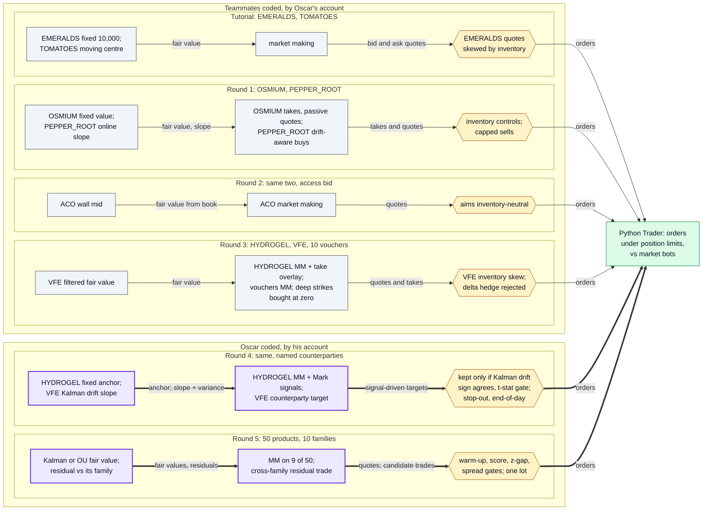
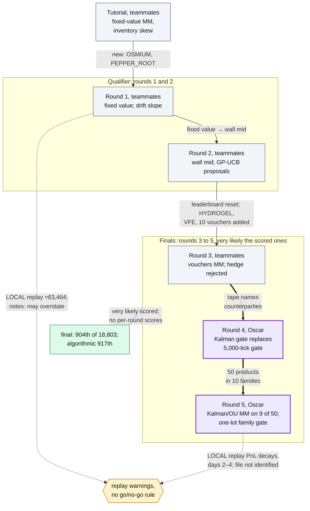
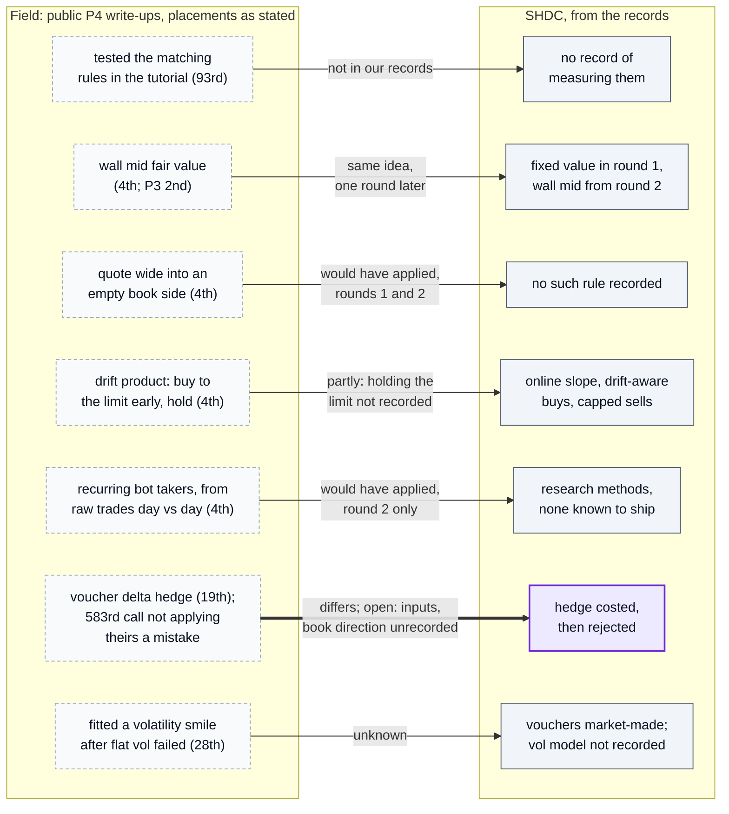
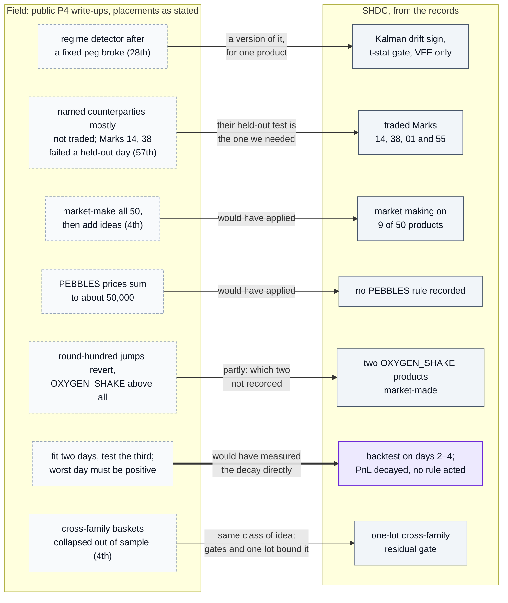

# Diagrams

Every node is a strategy line, round or result in this write-up's documents; every label comes
from the README or `docs/rounds/*.md`. The team's code is not published, so "where" lines point
at the documents that record it. The README embeds diagrams 1 and 2; diagrams 3 and 4 are in
[top-teams-comparison.md](top-teams-comparison.md).

*If a diagram and the code disagree, the code wins.*

1. [Strategy map per round](#1-strategy-map-per-round)
2. [Round timeline](#2-round-timeline)
3. [Against the field: tutorial to round 3](#3-against-the-field-tutorial-to-round-3)
4. [Against the field: rounds 4 and 5](#4-against-the-field-rounds-4-and-5)

## 1. Strategy map per round

What each round's trader did, from fair value to the controls on its orders, and who coded it (labels from the [round documents](rounds/tutorial.md)):

Where in the code: the team's trader files are not published; every node is a strategy line in `docs/rounds/tutorial.md` to `docs/rounds/round-5.md`, and who coded which round is from [Who did what](../README.md#who-did-what). All diagrams: [docs/DIAGRAMS.md](DIAGRAMS.md).

## 2. Round timeline

Round by round, what changed between rounds and where the local replays warned:

Where in the code: not published; sources are `docs/rounds/*.md`, [Results](../README.md#results) and [scoring](top-teams-comparison.md#how-the-rounds-were-scored) for the reset and the final ranks.

## 3. Against the field: tutorial to round 3

The field's idea against ours, rounds tutorial to 3 (teammates' rounds); each edge says how our version differs:

Where in the code: not published; each node is a row of [top-teams-comparison.md](top-teams-comparison.md) or a line of `docs/rounds/*.md`.

## 4. Against the field: rounds 4 and 5

Rounds 4 and 5 (Oscar's rounds), the same way:

Where in the code: not published; each node is a row of [top-teams-comparison.md](top-teams-comparison.md) or a line of `docs/rounds/*.md`. The field side draws on the nine Prosperity 4 write-ups listed in [credits](credits.md) (plus Prosperity 3 for wall mid); placements are as each source states them.
