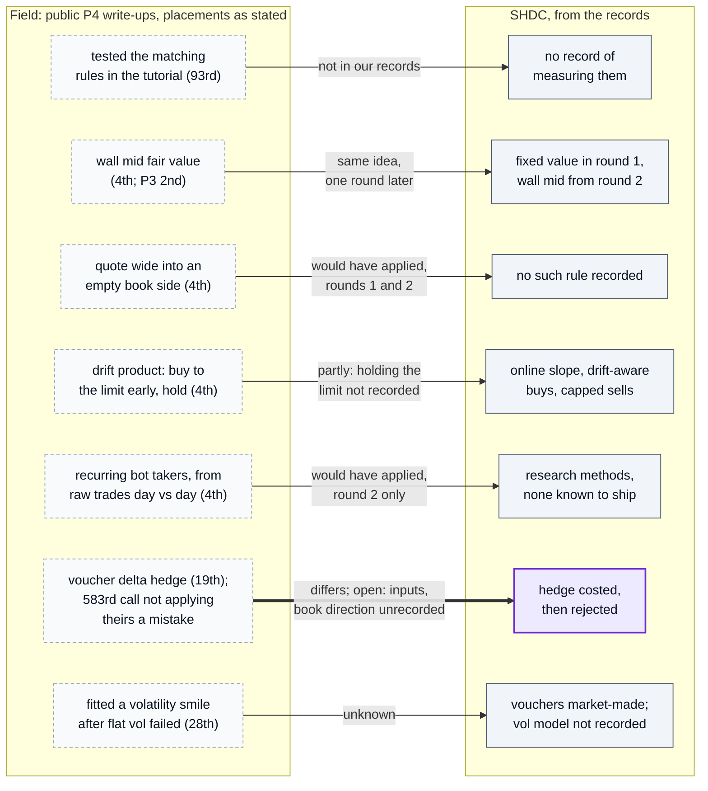
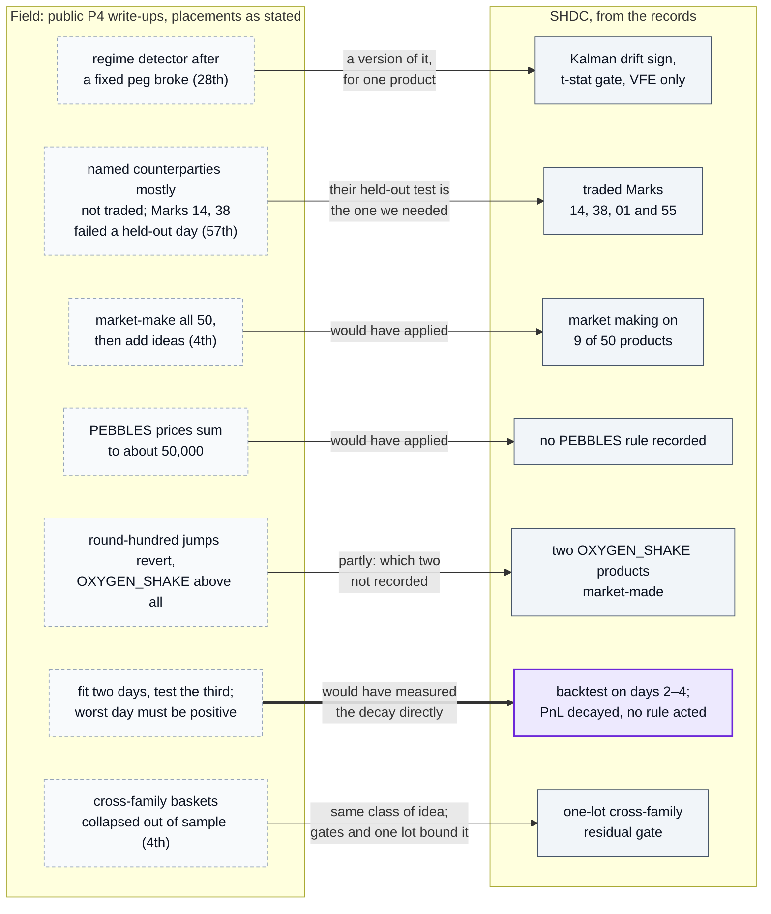

# What top teams did that we did not

Each row: one idea from a public write-up, summarised in our own words and linked; what the team did instead, from the audit of the team's code (Codex, 2026), relayed, original files not published; and whether it would have applied to us. Placements are as each source states them. All sources are listed in [credits](credits.md).

The field's idea against ours, rounds tutorial to 3 (teammates' rounds); each edge says how our version differs:

Rounds 4 and 5 (Oscar's rounds), the same way:

Where in the code: not published; each node is a row of the table below or a line of `docs/rounds/*.md`. The field side draws on the nine Prosperity 4 write-ups listed in [credits](credits.md) (plus Prosperity 3 for wall mid); placements are as each source states them.

| Theme | What top teams did | What we did | Would it have applied? |
|---|---|---|---|
| Fair value | Wall mid: the midpoint of the deep, large orders ([Frankfurt Hedgehogs](https://github.com/TimoDiehm/imc-prosperity-3), P3; [Une Baguette Fromage](https://github.com/Durpie-Git/imc-prosperity-4), P4 4th) | Fixed value in round 1, wall mid from round 2 ([round 1](rounds/round-1.md), [round 2](rounds/round-2.md)) | Yes, and we adopted it one round later |
| Empty book side | Quote very wide when one side of the book is empty; a hidden taker may hit it ([Une Baguette Fromage](https://github.com/Durpie-Git/imc-prosperity-4); missed by [Alpha Search](https://github.com/fabianbaiertum/IMC-Prosperity-4)) | No such rule recorded | Yes, rounds 1 and 2 |
| Drift product | Buy to the position limit early and hold, never short ([Une Baguette Fromage](https://github.com/Durpie-Git/imc-prosperity-4)) | Online slope estimate, drift-aware buys, capped sells ([round 1](rounds/round-1.md)) | Partly: whether we held the limit is not recorded |
| Bot behaviour | Recurring takers at the same time, side and size across days ([Une Baguette Fromage](https://github.com/Durpie-Git/imc-prosperity-4)) | Several research methods, none known to have shipped ([round 2](rounds/round-2.md)) | Round 2 only; it did not persist |
| Options hedging | Delta-hedged ([JaneRT](https://github.com/heyman7913/imc-prosperity-4), 19th); [Team Infinite 88](https://github.com/Chamoy-code/imc-prosperity-4-challenge) (583rd) list their unapplied hedge as a mistake | Costed and rejected: modelled hedge cost exceeded gamma-scalp value ([round 3](rounds/round-3.md#the-delta-hedging-decision)) | Open: our cost inputs and the book's direction are not recorded |
| Volatility surface | Fitted a smile after a flat volatility failed ([DTU Quant Lab](https://github.com/DataAthleteChamp/dtu-quant-lab-imc-prosperity-4), 28th); others found implied volatility stable per strike | Voucher market making; volatility model not recorded | Unknown |
| Regime change | Three-state regime detector after a fixed peg broke ([DTU Quant Lab](https://github.com/DataAthleteChamp/dtu-quant-lab-imc-prosperity-4)) | Kalman drift sign with a t-statistic gate on VFE ([round 4](rounds/round-4.md)) | We had a version of it, for one product |
| Named counterparties | Mostly not traded; copying Marks 14 and 38 did not generalise to a held-out day ([Team Ryan Challman](https://github.com/nathanw3456/Prosperity_4_Writeup)) | Traded signals from Marks 14, 38, 01 and 55 ([round 4](rounds/round-4.md)) | Yes: their test is the one we would need |
| Round-5 coverage | Market-make all 50 products as a backbone, then add targeted ideas ([Une Baguette Fromage](https://github.com/Durpie-Git/imc-prosperity-4), [Alpha Search](https://github.com/fabianbaiertum/IMC-Prosperity-4)) | Nine primary products plus a one-lot cross-family gate ([round 5](rounds/round-5.md)) | Yes |
| Exact identities | PEBBLES prices sum to about 50,000 ([rat_hunters](https://github.com/rmtf1111/imc-prosperity-4), [JaneRT](https://github.com/heyman7913/imc-prosperity-4)) | No PEBBLES rule recorded | Yes |
| Round-number jumps | Reversion after jumps to a round hundred, OXYGEN_SHAKE_CHOCOLATE above all ([rat_hunters](https://github.com/rmtf1111/imc-prosperity-4), [Une Baguette Fromage](https://github.com/Durpie-Git/imc-prosperity-4)) | Two OXYGEN_SHAKE products market-made; which two is not recorded | Yes |
| Out-of-sample checks | Fit on two days, test on the third ([Une Baguette Fromage](https://github.com/Durpie-Git/imc-prosperity-4)); ship only if the worst backtest day is positive ([DTU Quant Lab](https://github.com/DataAthleteChamp/dtu-quant-lab-imc-prosperity-4)) | Backtest over visible days 2–4; PnL decayed and the risk was written down ([round 5](rounds/round-5.md)) | Yes: a fit-on-two, test-on-one split measures that decay directly |
| Manual crowd modelling | Model the field before optimising: language-model crowd sampling, Nash plus a shift ([manual rounds](manual-rounds.md)) | Not recorded | Rounds 2 and 3 |
| Tooling | Per-product PnL attribution ([DTU Quant Lab](https://github.com/DataAthleteChamp/dtu-quant-lab-imc-prosperity-4)); a visualiser that caught a sign error before submission ([JaneRT](https://github.com/heyman7913/imc-prosperity-4)) | gsgill7's fork of jmerle's visualiser, GeyzsoN's Rust backtester, a team interface ([README](../README.md#credits-and-licence)) | We had the tools; how they were used is not recorded |

## How the rounds were scored

- **Two phases.** Rounds 1 and 2 were a qualifier ("phase 1") and rounds 3 to 5 the finals ("phase 2"). Three write-ups state that the leaderboard reset after round 2 and that the final ranking counts the finals only: [Team Infinite 88](https://github.com/Chamoy-code/imc-prosperity-4-challenge) ("determined by Phase 2 performance only (Rounds 3–5)"), [DTU Quant Lab](https://github.com/DataAthleteChamp/dtu-quant-lab-imc-prosperity-4) (cumulative PnL zeroed after the qualifier) and [Une Baguette Fromage](https://github.com/Durpie-Git/imc-prosperity-4) (progress reset after round 2). Our records do not state it, but nothing in them contradicts it.
- **Two tracks (confirmed by our records).** Algorithmic and manual have separate leaderboards, and the overall score is their sum: our 86,750 + 147,209 = 233,959, with a separate rank on each ([leaderboard screenshots](../assets/leaderboard/), taken 2026-06-01).
- **Visible days and hidden days.** Teams develop on visible sample days; the scored run uses days they have not seen. Our round-5 decision document names this as hidden-test risk (audit), and [Team Infinite 88](https://github.com/Chamoy-code/imc-prosperity-4-challenge)'s backtest-versus-live gap shows how large it can be.

So our final 233,959 very likely covers rounds 3 to 5, which include Oscar's rounds 4 and 5; per-round scores were not recorded ([README](../README.md#results)).
